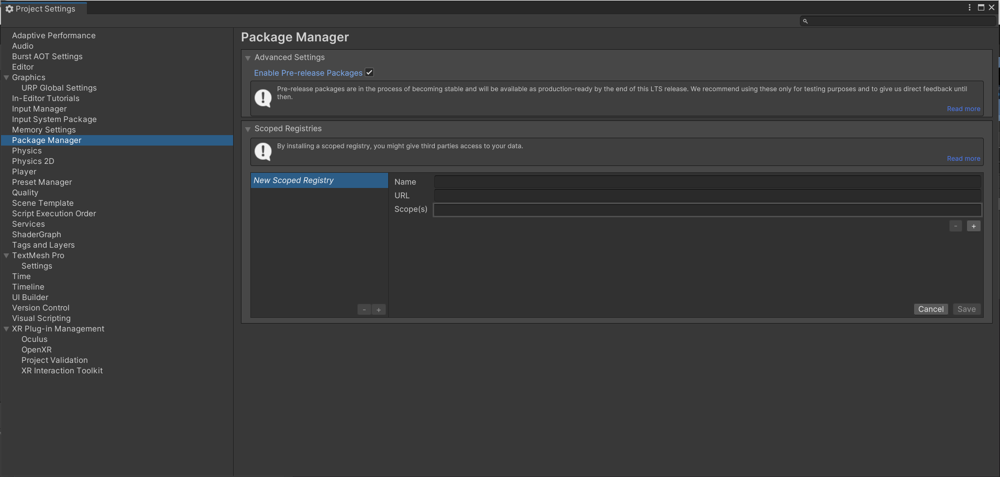
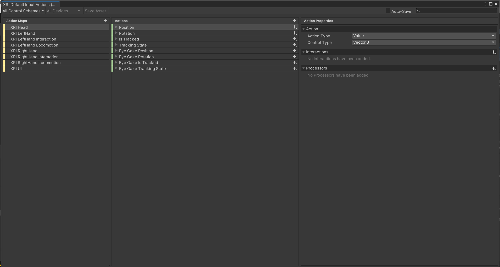

# Install XR Interaction toolkit

1. Buka Package Manager di Window>Package Manager.
2. Pada bagian Packages pilih Unity Registry.
3. Scroll kebawah dan cari XR Interaction Toolkit, kemudian Install atau Update
4. Jika tidak terdapat XR Interaction Toolkit, buka Project Settings, pergi ke Edit>Project Settings, Pilih Package Manager, dan centang Enable Pre-release Packages.

5. Klik Samples, disini ada beberapa opsi yang dapat ditambahkan pada Xr Interaction Toolkit. disini dibutuhkan Starter Assets yang menyertakan Default Input Actions dan Preset yang akan membantu menyiapkan sistem input baru untuk input VR. Klik Install/Update untuk Starter Assets.
6. Terdapat Actions dan Actions Map, yang dapat digunakan untuk mengelola berbagai bagian permainan. Misalnya, membuat Action Map bernama Kontrol UI dan mengelola semua input yang terkait dengan UI di dalam action map Kontrol UI ini. Di tengah, terdapat action dari action map. Actions adalah peristiwa tindakan aktual seperti Fire, Open Menu, Move, dll. Setiap Actions memiliki binding unik.
