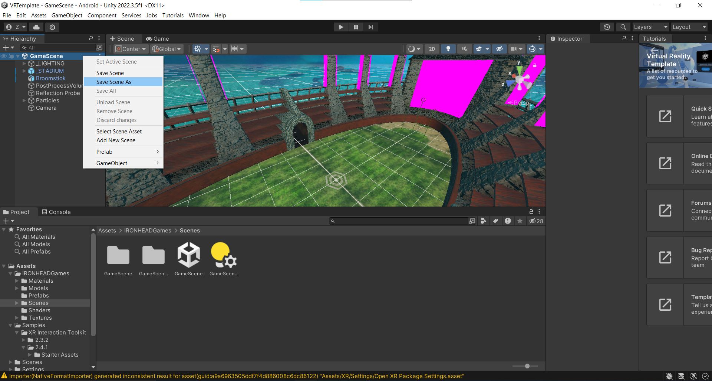

# Creating VR Player: XR Origin Setup

Sekarang adalah bagian persiapan _Rig XR_ yang memungkinkan melihat scene Unity di VR. Jika kita run game di Unity kita dapat melihat Scene dan game view, namun dalam development game VR, tentu perlu menjalankan game dalam VR. Sebelum dimulai, buat backup scene. caranya adalah dengan klik titik tiga pada game scene kemudian save as.

